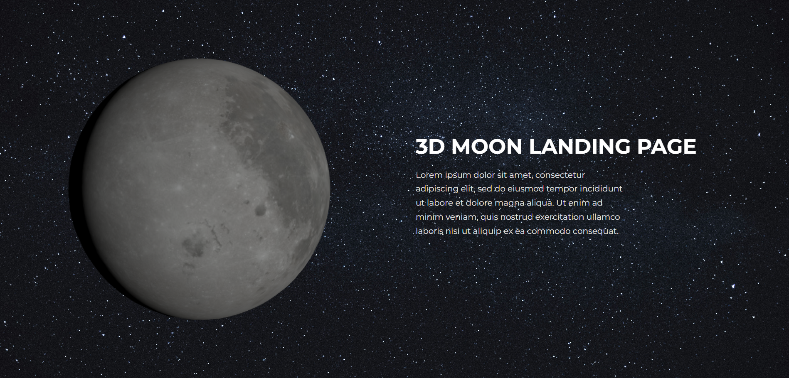

# 3D MOON LANDING PAGE WITH THREE.JS

## Description

Using Three.js's sphere geometry and textures, I crafted a realistic and detailed 3D moon.

### Table of Contents

1. [Installation](#installation)
2. [License](#license)
3. [Questions](#questions)

## INSTALLATION

- **npm create vite@latest**

  Creates a new Vite.js project using the latest version of the Vite package.

- **npm install**

  Installs project dependencies based on the information specified in the package.json file. It installs all the required packages listed as dependencies.

- **npm install three**

  Installs the three package as a project dependency. three is a popular JavaScript 3D library that is often used for creating 3D graphics and animations in web applications.

- **npm run dev**

  Starts the development server for your Vite.js project. It compiles and bundles your code, then launches a local development server where you can preview and test your application.

- **npm run build**

  Builds the app for production to the build folder.
  It correctly bundles React in production mode and optimizes the build for the best performance.
  Your app is ready to be deployed!

## LICENSE

This project is subject to the MIT licensing terms.

## QUESTIONS

Should you have any inquiries regarding this repository, feel free to raise an issue or reach out to me directly via [bbc.silva@gmail.com](mailto:bbc.silva@gmail.com).
Explore more of my work at [blaztted](https://www.github.com/blaztted).
